# Alzheimer's Disease Classification using ConvNeXt on the ADNI dataset

## Table of Contents

- [Overview](#overview)
- [Model Architecture](#model-architecture)
    - [Stage Compute Ratio](#stage-compute-ratio)
    - [Patchify Stem](#patchify-stem)
    - [ResNeXt Design Employment](#resnext-design-employment)
    - [Inverted Bottleneck](#inverted-bottleneck)
    - [Activation Functions](#activation-functions)
    - [Normalization Layer](#normalization-layer)
    - [Downsampling Layer](#downsampling-layer)
- [Dataset Description](#dataset-description)
    - [Overview](#overview-1)
    - [Preprocessing](#prepocessing)
    - [Datasplit](#datasplit)
- [Training Process](#training-process)
- [Results](#results)
    - [Performance Metrics](#performance-metrics)
    - [Example Predictions](#example-predictions)
- [Usage](#usage)
    - [Clone the Repository](#clone-the-repository)
    - [Install Dependencies](#install-dependencies)
    - [Directory Structure](#directory-structure)
    - [Adjust Hyperparameters](#adjust-hyperparameters)
    - [Train the Model](#train-the-model)
    - [Run Predictions on New Images](#run-predictions-on-new-images)
- [References](#references)

## Overview

This project goal is to classify between Alzheimer's Disease (AD) and Normal Control (NC) images in the Alzheimer's Disease Neuroimaging Initiative (ADNI) brain dataset [[1]](#adni-link). Early Alzheimer's detection helps patients take control of their conditions, gain access to necessary support and resources, and make informed plans for the future. ConvNeXt, which is one the latest vision model, is used in this classification problem. Using ConvNeXt architecture, the model reached 80.4% accuracy on the ADNI test dataset.

## Model Architecture

The ConvNeXt architecture is a pure ConvNet that is modernized from a standard ResNet toward the design of a vision Transformer. While being much simpler in design, ConvNeXts are reported to achieve the same level of accuracy and scalability as Transformers [[5]](#convnext). The ConvNeXt block architecture is shown in [Figure 1](#convnext-block).

<a id="convnext-block"></a>


Figure 1. ConvNeXt block architecture, adapted from Liu et al. (2022) [[5]](#convnext).


The ConvNeXt architecture in [Figure 2](#convnext-structure) comprises a series of stages which consists of multiple consecutive ConvNeXt blocks opearting at the same feature resolution. Each block includes depthwise convolution, layer normalization, pointwise convolution, layer scaling and residual connection with stochastic depth. As a ConvNet, this model has several built-in inductive biases that make it well-suited for a wide range of computer vision tasks such as classification of MRI images of the brain. It also proves to be efficient as computations are shared when used in a sliding-window manner [[5]](#convnext).

<a id="convnext-structure"></a>


Figure 2. ConvNeXt architecture, adapted from GeeksforGeeks [[3]](#convnext-gfg).

The ConvNeXt architeture consists of the following main innovations:

### Stage Compute Ratio

ConvNext has 4 stages and the number of blocks each stage is changed from (3, 4, 6, 3) in ResNet-50 to (3, 3, 9, 3).

### "Patchify" Stem

A simple "Patchify" stem (4 x 4 non-overlapping convolution) are used in this model to downsample input images to mimic the design of ViT to downsample the input images.

### ResNeXt Design Employment

A combination of depthwise convolution and 1 x 1 convolution is used that imitates the self-attention mechanism in Transformers. Network width increases to 96 channels. Channel-mixing design allows model to combine local features of images, especially medical images like in ADNI MRI dataset between different brain structures. Thus, the model can preserve both local and global pattern leading to better diagnostic.

### Inverted Bottleneck

A convolution with kernel size of 7 x 7 is used in each block that allows the model to focus on local regions. This enhances the model's ability to capture complex spatial patterns in images and identiy subtle anatomical changes in the brain by expanding the channel.

### Activation Functions

GELU activation is used in each block. The GELU layers are eliminated from residual block except for one between two 1 x 1 layers as seen in [Figure 1](#convnext-block). Fewer activation functions per layer helps to increase gradient flow and better preserve the information across layers.

### Normalization Layer

One Layer Normalization layer is used in each block to improve the convergence and reduce overfitting. Layer Normalization is used instead of Batch Normalization as it might have some negative effects on model's performance [[6]](#batchnorm). The use of Layer Normalization is important to improve training stability on small datasets like ADNI.

### Downsampling Layer

Separate downsampling layers are added between each stages where each of them is a 2 x 2 convolution layer with stride 2 for spatial downsampling. They reduce the spatial dimension while increasing the number of feature channels which allows the model to concentrate on high-level patterns in brain anatomy in MRI data.

## Dataset Description

### Overview

The ADNI dataset used in this project contains MRI images categorized into Alzheimer's Disease (AD) and Normal Control (NC) groups. Each image in the dataset is grayscale and have a resolution of 256 x 240 pixels. The filenames follow the format `patientID_index.png` where `patientID` identifies the patient and `index` is the image number. The statistics of the dataset including the number of images and patients across the train and test sets for both classes are shown in [Table 1](#adni-table).

<a id="adni-table"></a>

| Dataset Split  | AD Images | NC Images | Total Images | Patients  |
|----------------|-----------|-----------|--------------|-----------|
| **Train**      | 10,400    | 11,120    | 21,520       | 1,076     |
| **Test**       | 4,460     | 4,540     | 9,000        | 450       |
| **Total**      | 14,860    | 15,660    | 30,520       | 1526      |

Table 1. ADNI dataset split statistics (images and patients).

Sample MRI image from the ADNI dataset for Alzheimer's Disease (AD) and Normal Control (NC) classes are shown below.

  
Alzheimer's Disease (AD)

  
Normal Control (NC)

### Prepocessing

All MRI images are preprocessed before training. Images are resized to 224 x 224, converted to 3 channels to match input format of ConvNeXt and normalized using specific mean and standard deviation for each dataset. To enhance model's generalization and prevent overfitting, various data augmentation techniques are used:

- Horizontal Flipping: randomly flips the MRI image left to right.

- Random Rotation (10): slightly rotates the image to make the model less sensitive to small changes in head rotation during scanning.

- Color Jittering: changes the image brightness and contrast by 0.2.

- Random Affine Transformation (0.05): moves the image slightly up, down or sideways.

- RandAugment [[2]](#rand-augment) : applies serveral random transformation with different strengths to make the training data more diverse and reduce overfitting, as described in the ConvNeXt paper [[5]](#convnext).

- RandomErasing [[8]](#random-erasing) (0.25): randomly covers small parts of the image, forcing the model to use information from multiple brain regions instead of focusing on one specific area, following the ConvNext paper [[5]](#convnext).

### Datasplit

The training set is further split into training and validation subsets by patient ID to prevent data leakage, with 10% used for validation and the rest for training. Each patient appears only in one subset. The test set is used as provided.

## Training Process

The model was trained on the ADNI dataset using PyTorch framework. The model was trained for 450 epochs with early stopping based on validation loss to prevent overfitting. The AdamW optimizer was used to improve training stability and reduce overfitting through weight decay. Regularization schemes such as Label Smoothing [[7]](#label-smoothing) and Stochastic Depth [[4]](#stochastic-depth) were used to improve generalization.

The main hyperparameters used in the training process are summarized in [Table 2](#hyperparameters)

<a id="hyperparameters"></a>

| **Hyperparameter**            | **Value**                             |
| ------------------------------| --------------------------------------|
| Optimizer                     | AdamW                                 |
| Learning Rate                 | 4e-3                                  |
| Learning Rate Scheduler       | CosineAnnealingLR                     |
| Weight Decay                  | 0.01                                  |
| Batch Size                    | 256                                   |
| Epochs                        | 450                                   |
| Early Stopping Patience       | 50                                    |
| Stochastic Depth              | 0.1                                   |
| Layer Scale                   | 1e-6                                  |
| Label Smoothing               | 0.1                                   |
| Loss Function                 | CrossEntropyLoss                      |

Table 2. Summary of hyperparameters and training configuration.

## Results

### Performance Metrics

The training and validation loss recorded for each epoch are shown in [Figure 3](#training-curves). The model was trained for 450 epochs, and the best model was selected at epoch 430, where it got the lowest validation loss. The close alignment between the training and validation loss curves indicates that the model achieved good generalization without signs of overfitting as the validation performance remained stable throughout the later epochs.

<a id="training-curves"></a>

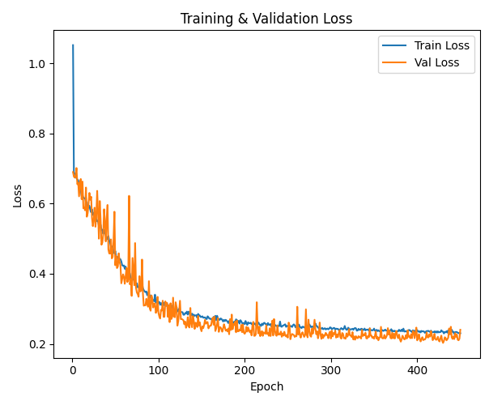

Figure 3. Training and Validation Loss Curves

To evaluate the model's performance on unseen data, the test set was used. The model achieved a **test accuracy of 0.804**, with a precision of 0.761, recall of 0.892, and an F1-score of 0.821. These results show that the model performs well overall, with particularly strong recall suggesting a good sensitiviy in detecting positive cases.

The confusion matrix for test results is shown in [Figure 4](#confusion-matrix). The results demonstate that ConvNeXt can effectively distinguish between AD and NC brain MRIs.

<a id="confusion-matrix"></a>

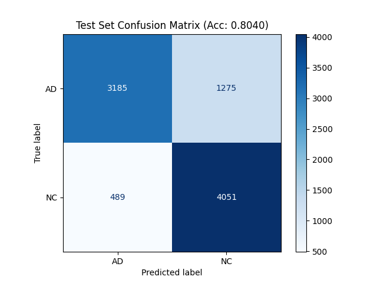

Figure 4. Test Set Confusion Matrix

The UMAP visualization in [Figure 5](#umap) shows clear separation between AD and NC embeddings. The NC cluster is more compact and well-defined suggesting the model learned more consistent representations for NC samples compared to AD.

<a id="umap"></a>

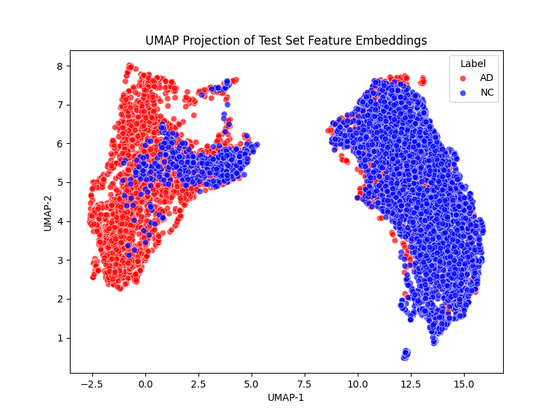

Figure 5. UMAP projection of test set feature embeddings.

### Example Predictions

[Table 3](#predictions) shows example predictions of the ConvNeXt model on some test images, including the predicted table and corresponding confidence scores for selected AD and NC images.

<a id="predictions"></a>

| Image                                | True Label | Predicted Label | Confidence | GradCam Visualisation                    |
| ------------------------------------ | ---------- | --------------- | ---------- | ---------------------------------------- |
|   | AD         | AD              | 0.943      | 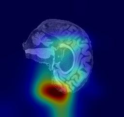
| 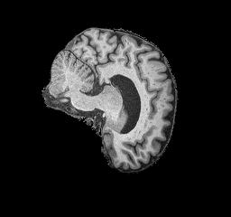  | AD         | AD              | 0.755      | 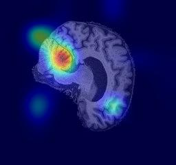
| 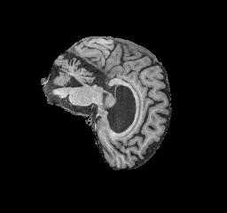  | AD         | AD              | 0.942      | 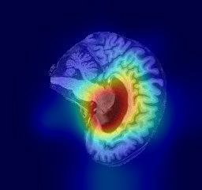
|   | NC         | NC              | 0.954      | 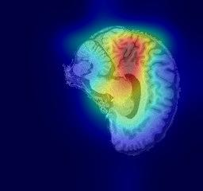
| 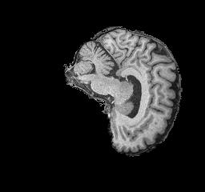  | NC         | NC              | 0.955      | 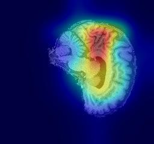
|   | NC         | NC              | 0.955      | 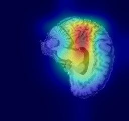

Table 3. Example test set predictions of the ConvNeXt model with corresponding confidence scores.

## Usage

### Clone the Repository

Clone the project from GitHub.

```bash
git clone https://github.com/thanhnhatquangmai/PatternAnalysis-2025.git
git checkout topic-recognition
cd ./recognition/ConvNeXt-s4934722
```

### Install Dependencies

This project requires Python 3.9.0 so ensure it is installed before proceeding. Then install the required packages.

```bash
pip install -r requirements.txt
```

### Directory Structure

The directory is assumed to follow this structure.

```bash
ConvNeXt-s4934722/
├── ADNI/
│   └── AD_NC/
│       ├── train/
│       │   ├── AD/
│       │   │   ├── 388206_78.jpeg
│       │   │   └── ...
│       │   └── NC/
│       │       ├── 1182968_94.jpeg
│       │       └── ...
│       └── test/
│           ├── AD/
│           │   ├── 218391_78.jpeg
│           │   └── ...
│           └── NC/
│               ├── 808819_88.jpeg
│               └── ...
│
├── images/
│   ├── ADNI/
│   └── report/
│
├── dataset.py
├── modules.py
├── train.py
├── predict.py
└── requirements.txt
```

### Adjust Hyperparameters

Key hyperparameters such as batch size, learning rate, number of epochs, or label smoothing can be modified in `train.py`.

```python
EPOCHS = 450
LEARNING_RATE = 4e-3
BATCH_SIZE = 256
LABEL_SMOOTHING = 0.1
```

### Train the Model

Run the training pipeline to train the model.

```bash
python train.py
```

This will:

- Load and preprocess the dataset.
- Train the ConvNeXt model.
- Save the best model checkpoint (`best_convnext.pth`)
- Generate training/validation loss plots and confusion matrices under `plots/`

### Run Predictions on New Images

Once the model is trained, you can run inference on MRI images.

To predict a single image:

```bash
python predict.py [--path path/to/image.jpeg] [--model path/to/model.pth] [--cam]
```

Multiple images can also be processed from a folder:

```bash
python predict.py [--path path/to/folder] [--model path/to/model.pth] [--cam]
```

If `--cam` is included, the script generates and saves GradCam visualisations overlayed on the original MRi images.

If no arguments are provided, the script defaults to:

`--path=./images/ADNI`

`--model=./best_convnext.pth`

Example output:

```bash
Loading model from: ./best_convnext.pth
Model loaded successfully.

Running inference on folder: ./images/ADNI

Saved CAM: ./images/ADNI\AD_1_cam.jpg
AD_1.jpeg                      -> AD (0.943)
Saved CAM: ./images/ADNI\AD_2_cam.jpg
AD_2.jpeg                      -> AD (0.755)
Saved CAM: ./images/ADNI\AD_3_cam.jpg
AD_3.jpeg                      -> AD (0.942)
Saved CAM: ./images/ADNI\NC_1_cam.jpg
NC_1.jpeg                      -> NC (0.954)
Saved CAM: ./images/ADNI\NC_2_cam.jpg
NC_2.jpeg                      -> NC (0.955)
Saved CAM: ./images/ADNI\NC_3_cam.jpg
NC_3.jpeg                      -> NC (0.955)
```

## References

<a id="adni-link"></a>[1] Alzheimer's Disease Neuroimaging Initiative (ADNI). [https://adni.loni.usc.edu](https://adni.loni.usc.edu/)

<a id="rand-augment"></a>[2] Cubuk, E. D., Zoph, B., Shlens, J., & Le, Q. V. (2020). *RandAugment: Practical automated data augmentation with a reduced search space*. In CVPR. [https://arxiv.org/abs/1909.13719](https://arxiv.org/abs/1909.13719)

<a id="convnext-gfg"></a>[3] GeeksforGeeks. *ConvNeXt Architecture Overview*. Available at: [https://www.geeksforgeeks.org/computer-vision/convnext/](https://www.geeksforgeeks.org/computer-vision/convnext/)

<a id="stochastic-depth"></a>[4] Huang, G., Liu, Z., van der Maaten, L., & Weinberger, K. Q. (2017). *Densely Connected Convolutional Networks (DenseNet)*. In CVPR. [https://arxiv.org/abs/1608.06993](https://arxiv.org/abs/1608.06993)

<a id="convnext"></a>[5] Liu, Z., Mao, H., Wu, C. Y., Feichtenhofer, C., Darrell, T., & Xie, S. (2022). *A ConvNet for the 2020s*. In CVPR. [https://arxiv.org/abs/2201.03545](https://arxiv.org/abs/2201.03545)

<a id="batchnorm"></a>[6] Wu, Y., & Johnson, J. (2021). *Rethinking "Batch" in BatchNorm*. [https://arxiv.org/abs/2105.07576](https://arxiv.org/abs/2105.07576)

<a id="label-smoothing"></a>[7] Szegedy, C., Vanhoucke, V., Ioffe, S., Shlens, J., & Wojna, Z. (2016). *Rethinking the Inception Architecture for Computer Vision*. In CVPR. [https://arxiv.org/abs/1512.00567](https://arxiv.org/abs/1512.00567)

<a id="random-erasing"></a>[8] Zhong, Z., Zheng, L., Kang, G., Li, S., & Yang, Y. (2020). *Random Erasing Data Augmentation*. In AAAI. [https://arxiv.org/abs/1708.04896](https://arxiv.org/abs/1708.04896)


