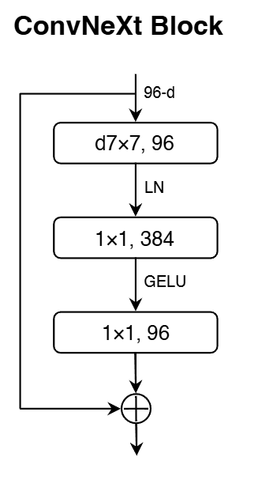
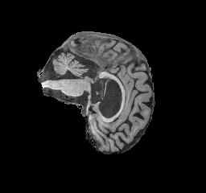
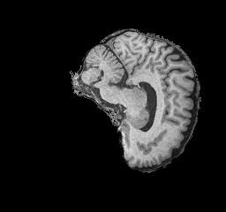

# Alzheimer's Disease Classification using ConvNeXt on the ADNI dataset

## Overview

This project goal is to classify between Alzheimer's Disease (AD) and Normal Control (NC) images in the Alzheimer's Disease Neuroimaging Initiative (ADNI) brain dataset [[1]](#adni-link). Early Alzheimer's detection helps patients take control of their conditions, gain access to necessary support and resources, and make informed plans for the future. ConvNeXt, which is one the latest vision model, is used in this classification problem. Using ConvNeXt architecture, the model reached 80.4% accuracy on the ADNI test dataset.

## Model Architecture

The ConvNeXt architecture is a pure ConvNet that is modernized from a standard ResNet toward the design of a vision Transformer. While being much simpler in design, ConvNeXts are reported to achieve the same level of accuracy and scalability as Transformers [[3]](#convnext). The ConvNeXt block architecture is shown in [Figure 1](#convnext-block).

*Figure 1. ConvNeXt block architecture, adapted from Liu et al. (2022)* [[3]](#convnext)*.*

The ConvNeXt architecture comprises a series of stages which consists of multiple consecutive ConvNeXt blocks opearting at the same feature resolution. Each block includes depthwise convolution, layer normalization, pointwise convolution, layer scaling and residual connection with stochastic depth. As a ConvNet, this model has several built-in inductive biases that make it well-suited for a wide range of computer vision tasks such as classification of MRI images of the brain. It also proves to be efficient as computations are shared when used in a sliding-window manner [[3]](#convnext).

The ConvNeXt architeture consists of the following main innovations:

### Stage Compute Ratio

ConvNext has 4 stages and the number of blocks each stage is changed from (3, 4, 6, 3) in ResNet-50 to (3, 3, 9, 3).

### "Patchify" Stem

A simple "Patchify" stem (4 $\times$ 4 non-overlapping convolution) are used in this model to downsample input images to mimic the design of ViT to downsample the input images.

### ResNeXt Design Employment

A combination of depthwise convolution and 1 $\times$ 1 convolution is used that imitates the self-attention mechanism in Transformers. Network width increases to 96 channels. Channel-mixing design allows model to combine local features of images, especially medical images like in ADNI MRI dataset between different brain structures. Thus, the model can preserve both local and global pattern leading to better diagnostic.

### Inverted Bottleneck

A convolution with kernel size of 7 $\times$ 7 is used in each block that allows the model to focus on local regions. This enhances the model's ability to capture complex spatial patterns in images and identiy subtle anatomical changes in the brain by expanding the channel.

### Activation Functions

GELU activation is used in each block. The GELU layers are eliminated from residual block except for one between two 1 $\times$ 1 layers as seen in [Figure 1](#convnext-block). Fewer activation functions per layer helps to increase gradient flow and better preserve the information across layers.

### Normalization Layer

One Layer Normalization layer is used in each block to improve the convergence and reduce overfitting. Layer Normalization is used instead of Batch Normalization as it might have some negative effects on model's performance [[4]](#batchnorm). The use of Layer Normalization is important to improve training stability on small datasets like ADNI.

### Downsampling Layer

Separate downsampling layers are added between each stages where each of them is a 2 $\times$ 2 convolution layer with stride 2 for spatial downsampling. They reduce the spatial dimension while increasing the number of feature channels which allows the model to concentrate on high-level patterns in brain anatomy in MRI data.

## Dataset Description

### Overview

The ADNI dataset used in this project contains MRI images categorized into Alzheimer's Disease (AD) and Normal Control (NC) groups. Each image in the dataset is grayscale and have a resolution of 256 $\times$ 240 pixels. The filenames follow the format `patientID_index.png` where `patientID` identifies the patient and `index` is the image number. The statistics of the dataset including the number of images and patients across the train and test sets for both classes are shown [Table 1](#adni-table).

| Dataset Split  | AD Images | NC Images | Total Images | Patients  |
|----------------|-----------|-----------|--------------|-----------|
| **Train**      | 10,400    | 11,120    | 21,520       | 1,076     |
| **Test**       | 4,460     | 4,540     | 9,000        | 450       |
| **Total**      | 14,860    | 15,660    | 30,520       | 1526      |

**Table 1.** ADNI dataset split statistics (images and patients).

Sample MRI image from the ADNI dataset for Alzheimer's Disease (AD) and Normal Control (NC) classes are shown below.

  
*Alzheimer's Disease (AD)*

  
*Normal Control (NC)*

### Prepocessing

All MRI images are preprocessed before training. Images are resized to 224 $\times$ 224, converted to 3 channels to match input format of ConvNeXt and normalized using specific mean and standard deviation for each dataset. To enhance model's generalization and prevent overfitting, various data augmentation techniques are used:

- Horizontal Flipping: randomly flips the MRI image left to right.

- Random Rotation ($\pm10\degree$): slightly rotates the image to make the model less sensitive to small changes in head rotation during scanning.

- Color Jittering: changes the image brightness and contrast by 0.2.

- Random Affine Transformation ($\pm5\%$): moves the image slightly up, down or sideways.

- RandAugment [[2]](#rand-augment) : applies serveral random transformation with different strengths to make the training data more diverse and reduce overfitting, as described in the ConvNeXt paper [[3]](#convnext).

- RandomErasing [[5]](#random-erasing) ($25\%$): randomly covers small parts of the image, forcing the model to use information from multiple brain regions instead of focusing on one specific area, following the ConvNext paper [[3]](#convnext).

### Datasplit

The training set is further split into training and validation subsets by patient ID to prevent data leakage, with $10\%$ used for validation and the rest for training. Each patient appears only in one subset. The test set is used as provided.

## Training Process

## Results

## Usage

## References

[1] Alzheimer's Disease Neuroimaging Initiative (ADNI). [https://adni.loni.usc.edu](https://adni.loni.usc.edu/)

[2] Cubuk, E. D., Zoph, B., Shlens, J., & Le, Q. V. (2020). *RandAugment: Practical automated data augmentation with a reduced search space*. [https://arxiv.org/abs/1909.13719](https://arxiv.org/abs/1909.13719)

[3] Liu, Z., Mao, H., Wu, C. Y., Feichtenhofer, C., Darrell, T., & Xie, S. (2022). *A ConvNet for the 2020s*. [https://arxiv.org/abs/2201.03545](https://arxiv.org/abs/2201.03545)

[4] Wu, Y., & Johnson, J. (2021). *Rethinking "Batch" in BatchNorm*. [https://arxiv.org/abs/2105.07576](https://arxiv.org/abs/2105.07576)

[5] Zhong, Z., Zheng, L., Kang, G., Li, S., & Yang, Y. (2020). *Random Erasing Data Augmentation*. [https://arxiv.org/abs/1708.04896](https://arxiv.org/abs/1708.04896)

